# DLX解算模块
这个子项目实现了基于DLX算法的少钱芯片拼图方案的求解。  
程序从json中分别读取重装参数和芯片参数，然后根据参数求解。  

## 算法过程
求解算法基于DLX。  
将重装的格子按行首尾相连为一行，能放的格子为0，反之为1；  
将芯片依次尝试可行的旋转角度（排除对称）以及枚举放置位置，将可行的位置同样形成首尾相连的一行，芯片为1，其他为0。  
这样就将芯片求解问题转化为n*m的01矩阵的精确覆盖问题，随后用DLX算法求解。  
需要说明，目前采用了开源的DLX算法，他的可留空的设置有bug，遇到可留空的重装方案只能通过枚举空格位置实现。  

## 芯片说明
芯片代码目前采用与游戏内数据相同的代码，名称采用乐章版命名，列表如下，表中所有芯片均为游戏内0度方向：  
| 图例 | 名称 | 级别 | 级别代码 | 形状代码 |  
| -- | -- | -- | -- | -- | -- |  
| 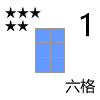 | 1 | 6格 | 5061 | 30 |  
| 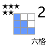 | 2 | 6格 | 5061 | 31 |  
| 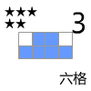 | 3 | 6格 | 5061 | 32 |  
| 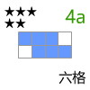 | 4a | 6格 | 5061 | 33 |  
| 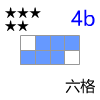 | 4b | 6格 | 5061 | 34 |  
| 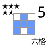 | 5 | 6格 | 5061 | 35 |  
| 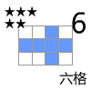 | 6 | 6格 | 5061 | 36 |  
|  | 7 | 6格 | 5061 | 37 |  
| 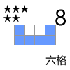 | 8 | 6格 | 5061 | 38 |  
| 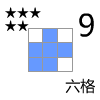 | 9 | 6格 | 5061 | 39 |  
| 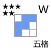 | W | 5格1类 | 5051 | 21 |  
| 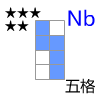 | Nb | 5格1类 | 5051 | 22 |  
| 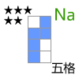 | Na | 5格1类 | 5051 | 23 |  
| 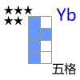 | Yb | 5格1类 | 5051 | 24 |  
| 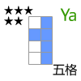 | Ya | 5格1类 | 5051 | 25 |  
| 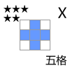 | X | 5格1类 | 5051 | 26 |  
| 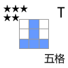 | T | 5格1类 | 5051 | 27 |  
| 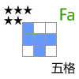 | Fa | 5格1类 | 5051 | 28 |  
| 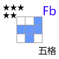 | Fb | 5格1类 | 5051 | 29 |  
| 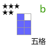 | b | 5格2类 | 5052 | 12 |  
| 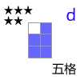 | d | 5格2类 | 5052 | 13 |  
| 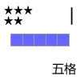 | T | 5格2类 | 5052 | 14 |  
| 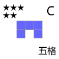 | C | 5格2类 | 5052 | 15 |  
|  | Z | 5格2类 | 5052 | 16 |  
| 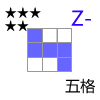 | Z- | 5格2类 | 5052 | 17 |  
| 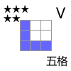 | V | 5格2类 | 5052 | 18 |  
| 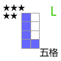 | L | 5格2类 | 5052 | 19 |  
| 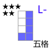 | L- | 5格2类 | 5052 | 20 |  

注：图片资源以及命名法来自[命运の乐章](https://github.com/hycdes/GFTool)。

## json说明
重装配置文件中，`name`为方案名称，`optional`为可空的格子数量，`chips`为使用的芯片类型列表。  
`*-result.json`为对应的方案数组，其中每个方案均记录了每个芯片的`rotate`旋转角度（以0-3标志90度顺时针旋转了几次）和坐标。  
